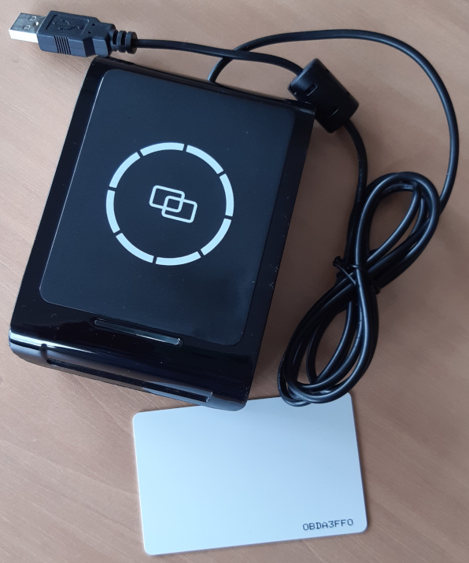

# libS9
Python library for IC Card Reader S9-BU-00-01 from Fongwah




## foreword

the library is intended to be used with `Python3` under `Linux`.
it only implements some functions from `libS8.so` around `Mifare S50 tags` (classic 1k EV1).
only the `A key` is used.
except `readUID`, all the proposed functions expect a `block number` as input.


## usage

```pycon
>>> from libS9 import Reader

>>> reader = Reader('/dev/usb/hiddev3')

>>> reader.readUID()
'0BDA3FF0'

>>> reader.readBlock()
'0BDA3FF0:0:F03FDA0B1E8804000000000000000000'
>>> reader.readBlock(0)
'0BDA3FF0:0:F03FDA0B1E8804000000000000000000'
>>> reader.readBlock(0, 'FF'*6)
'0BDA3FF0:0:F03FDA0B1E8804000000000000000000'

>>> reader.readBlock(0)
'0BDA3FF0:0:F03FDA0B1E8804000000000000000000'
>>> reader.readBlock(1)
'0BDA3FF0:1:00000000000000000000000000000000'
>>> reader.readBlock(2)
'0BDA3FF0:2:00000000000000000000000000000000'
>>> reader.readBlock(3)
'0BDA3FF0:3:000000000000FF078000FFFFFFFFFFFF'
>>> reader.readSector(2)
['0BDA3FF0:0:F03FDA0B1E8804000000000000000000', '0BDA3FF0:1:00000000000000000000000000000000', '0BDA3FF0:2:00000000000000000000000000000000', '0BDA3FF0:3:000000000000FF078000FFFFFFFFFFFF']
```
